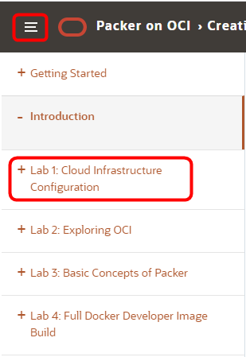

# Creating OCI Images using Packer - OCI for Developers

Welcome to the **Oracle Cloud Infrastructure** Compute image building with Packer workshop. This workshop will walk you through the process of creating an custom infrastructure image to support a variety of DevOps and production use-cases.

As part of this workshop, you will complete labs helping you to better understand:

- Configuring OCI to support and Image
- Launching and image and installing software (packer and git)
- Using Packer and Git to build a custom OCI image which is configured to support a desktop login via VNC, firewall configuration and a custom environment (alias setup and variables)

To learn more about this workshop please watch the video below.  

<a href="https://videohub.oracle.com/media/PackerA+Overview/1_i0algeik" target="video">Workshop Overview Video</a>

### **Step 1**: Navigate to Lab 1

- _You can see a list of Lab Guides_ by clicking on the **Menu Icon** hamburger in the upper left corner of the browser window. Then, **Select Lab 1: Cloud Infrastructure Configuration**.

  
