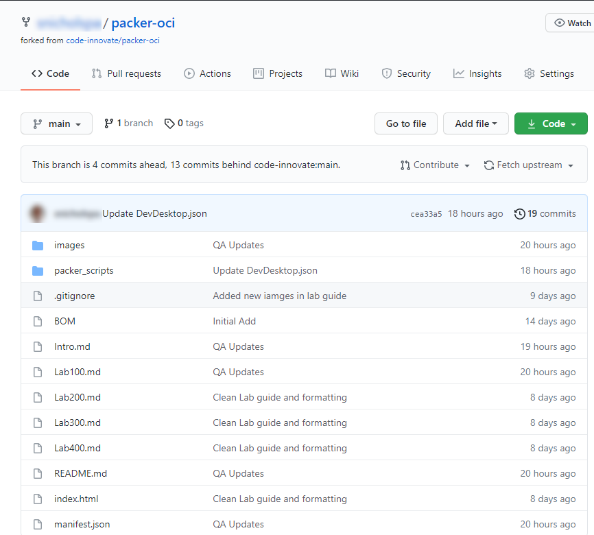
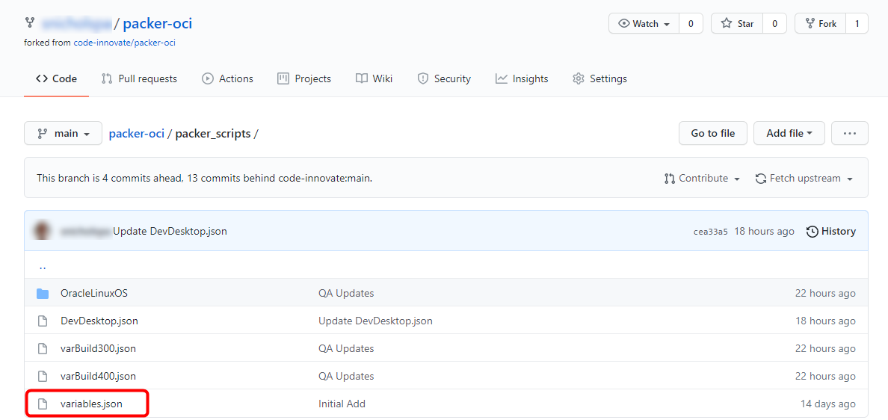

# Packer Workshop - Cloud Infrastructure Configuration
## Before You Begin
### Introduction

This is the first of several labs which are part of **Oracle Public Cloud Build OCI images with packer workshop.** This workshop will walk you through the process of creating custom OCI images in you own Oracle Cloud Trial account.

You will take on the persona of **Infrastructure Engineer** during this workshop. As such, you've been asked to recommend a solution for deploying software currently packaged as VMWare Images running on-site at AlphaOffice.  You will do an evaluation based on development environments, build for and given to developers to build and test applications deployed in Docker.  It's a straightforward example of a Unix System, running a Desktop (gnome), with git installed, firewall configured to allow VNC access and local services.  It's configuration also been reviewed by the security team.

### Objectives

- Login to your Oracle Cloud Trial or Workshop Account
- Create the baseline infrastructure to support a Compute image
- Use/practice git & Github

### Required Artifacts

- The following lab requires:
  - Laptop (Windows, Mac or Linux)
  - An Oracle Cloud Trial Account or Workshop Account
  - A Github account [https://github.com/join](https://github.com/join)

**Note:** This workshop runs from a Cloud Compute Client instance based on Oracle Linux 7.  The goal is to minimize changes/additions to the students laptop.  You will install packer on a Compute instance in the cloud.  If you have administrative access on your laptop and would like to install (packer & git) locally on your windows or mac laptop, the same instructions will work with little/no modification.
## **STEP 1**: Fork Repository from GitHub

Using git is very common for cloud development, it provides source control and management of software, configuration and documentation files.  For the purposes of this workshop, you make use of GitHub for its ability to store, view and edit important files used in image creation - details allowing packer to build in your OCI environment

By forking our workshop's github repository to YOUR github account, you have a working copy of this lab, allowing you to edit files (add your cloud identifiers to a json file) using the web interface of github. You can also keep any assets you create, even when your trial expires.

- From a **new window** any browser, go to <a href="https://github.com/code-innovate/packer-oci" target="new">https://github.com/code-innovate/packer-oci</a>

- Click **Fork** in the upper right hand corner of the browser. **Sign in** if prompted.

  **NOTE:** If prompted, choose to fork the repository to your account (this may occur if your account is also a member of an organization on GitHub).

  
  you might catch:

  

-  You will see that a copy of the _packer-oci_ repository is now in your Github account.  This will allow you to make changes to items tied to your Cloud Account.

  

## **STEP 2**: Create a Copy of variables.json called DevDesktop.json

-  Using your browser, **navigate** in your Github repository to:  

    -  **packer-oci ->packer_scripts**

- There, you should see:

  

-  **Open** variables.json using the browser interface.

- Click the filename **variables.json**, bringing up the files, Highlight the template variables, and copy them to your clipboard (cntrl-C or &#8984;-C)

  

- **Return to packer\_scripts directory** - click on **packer_scripts**:

  

- Create a new file using the **Add file -> Create new file** button.

  

- Call it **DevDesktop.json** (since it will be a docker developer's desktop image). This file will store the variables (OCID, region and base image) specific to your Cloud tenancy.

- **Paste** the contents of *variables.json* from your clipboard

   

- **Commit** the file, with a comment, using the button below the Editor

   

As you navigate around Oracle Cloud Infrastructure, you will want to keep your _DevDesktop.json_ file open to collect the required identifiers.  As you create compartments and networks, you will be asked to paste identifiers into this file. 
## **STEP 3**: Log in to your OCI dashboard

- Once you receive the **Get Started with Oracle Cloud** Email, make note of your **Username, Password and Cloud Account Name**.

- From any browser go to:

    [https://cloud.oracle.com/en_US/sign-in](https://cloud.oracle.com/en_US/sign-in)

- Enter your **Cloud Account Name** in the input field and click the **Next** button.

  

  

- Enter your **Username** and **Password** in the input fields and click **Sign In**.

  

- You are presented with the Oracle Cloud Infrastructure (OCI) Dashboard/Portal.

  

## **STEP 4**: Generate User API PEM Key

- Click on User icon on top right corner and then click on username

  

- Click on the API keys and then Add API Key
  
  

- **Generate** API Key Pair and download private and public key.
  
  

- Once key is generated you will be presented with a configuration file.   **Copy** User OCID, Fingerprint, Tenancy OCID and Region values and **Paste** into your **DevDesktop.json** file
  
  
## **STEP 5**: Create a Compartment

Compartments are used to isolate resources within your OCI tenant. User & Group-based access policies can be applied to manage access to compute instances and other resources within a Compartment.

- Open the hamburger menu and click **Compartments** under the **Identity & Security** section:

   

- Click on **Create Compartment**
  
    

- Give name and description in the create compartment page.

  

## **STEP 6**: Collect Packer Compartment's OCID

- Now, you can copy the new compartment's OCID to the **DevDesktop.json** file using the **copy** link and **Paste** into your **DevDesktop.json** file **my.compartment_ocid** line.
  
  

  

**This completes this Lab 1**

**You are ready to proceed to Lab 2**
