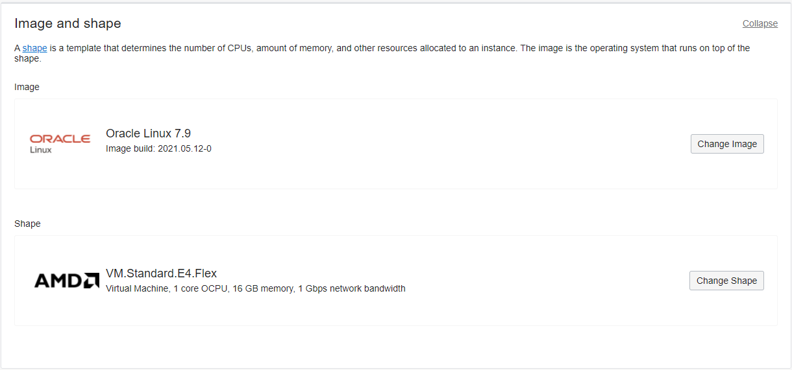
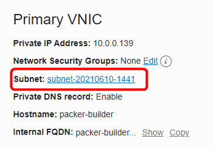
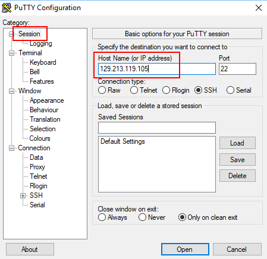

# Packer Workshop - Exploring OCI
## Before You Begin
### Introduction

In this lab you launch a compute instance, install packer and create an environment for building your first, custom image of CentOS 7.  You will learn to securely connect to this compute image using secure shell and to create keys used to secure API calls.  You will gain familiarity with Oracle Cloud Infrastructure's operation and security features.
### Objectives

- Create Compute Image
- Install Packer & git in Client Compute Image
- Gather remaining OCIDs for Cloud objects
- Secure VNC by changing the password
### Required Artifacts

- Oracle Cloud Account - (configured in Lab 1)
- Your public ssh key from Lab 1
- **DevDesktop.json** file open in GitHub
## **STEP 1**: Create an OCI Compute Instance

You will now create a CentOS-based Compute instance and will install public key half of the key-pair you just generated.  This is the Client Image.  The Client Image is a stand-in for your laptop or development workstation as some attendee's might have issues installing on their laptop due to administrative controls or policies.  You will then use the Private half of the key pair to connect from your laptop, over ssh, to the Client Image.

**NOTE:** Feel free to install packer and git on your laptop if you feel comfortable doing so...

- From your OCI console, use the **hamburger menu** in the upper left hand corner,
select **Compute-->Instances**

  

-  Before Creating the compute instance, let's collect the Availability Domain name required in the **DevDesktop.json** file.  Scroll down within the OCI Console until you see the **Availability Domain** section.  Copy the first one in the list and paste the value in the **DevDesktop.json** for the **my.availability_domain** line.

    

- Click **Create Instance** and make sure you are in correct compartment.

  

- You will **Select, Leave Default or Type** the following in the **Create Compute Instance** section of the dialog:

- Enter **packer-builder** as your Instance Name

```
Name: packer-builder
Availability Domain: AD 1 (please Use default AD 1)
Boot Volume: Oracle-Provided OS Image
Image Operating System: Oracle Linux 7
Shape: VM.Standard.E4.Flex (Default)
SSH Keys: Generate/Download SSH Key Files
```
- Give name **packer-builder** and leave default AD, i.e **AD 1**

  

- Leave default Image and Shape
  
  

- Under Networking, **Select** on **Create new virtual cloud network** and give name **packer-vcn** and make sure correct compartment is selected. Also assign public IP
  
  

- **Generate** SSH keys and download both private and public keys. If you already have key pair, use them.
  
  

- **Click** Create.

  

In a couple minutes, you should see your instance provisioning and the Public IP Address.  You will notice the OCID has been generated.  This unique identifier can be used to refer to this image using the REST API or in other processes.

  
  

- Make a note of the **Public IP Address** as you will be using this in the next step.

## **STEP 2**: Collect Packer-build subnet OCID

- **Click** on the Subnet name as shown in image.



- Now you can **copy** subnet OCID to the **DevDesktop.json** file by using the **copy** link. 


## **STEP 3**: Add a Security List entry

A security list provides a virtual firewall for an instance. You will allow traffic to the VNC servers on port 5901. The Security List contains ingress and egress rules that specify the types of traffic allowed in and out. Each security list is enforced at the instance level, however, you configure your security lists at the subnet level. This applies the same set of rules to each instances in a given subnet. The security lists apply to a given instance whether it's interacting with another instance in the VCN or a host outside the VCN.

- Select the **Default Security List** from the Subnets listed on the VCN page.


For the purposes of the upcoming Packer-built image deployments, you need to add an Ingress (incoming traffic) Rule that allows VNC.

- **Click** Add Ingress Rule

  **NOTE:** Our goal is to add new rule, not change existing ones...

  

- **Enter the following as Ingress Rule 1**

  **NOTE:** Leave all other values at default

```
Source CIDR: 0.0.0.0/0
Destination Port Range: 5901
```
  
  
  - Click the **Add Ingress Rules** button

- Your Ingress Rules should look like:

  

 This opens port 5901 to the public internet! For the purposes of this lab, you should be fine.  If you do this in any other account (e.g. not your 30-day trial), pay close attention to the ports your open.  You can enter very narrow port ranges to lock port access down to a single corporate network, or corporate networks + hosted servers specifically designed to access and audit administrative access to cloud instances.  
## **STEP 4**: Connect via SSH to the Instance

Next, you will SSH into the Compute instance and install packer and git.  You will use the private ssh key to connect with the newly started image.  Any SSH client can be used, but the examples here are the most common, Putty (for Windows) and built-in ssh for Linux/Mac Laptops.

#### **Windows:**

- For a Windows client launch Putty, select the **Session** section and type in the IP address:

   

- Select the **Data** section and enter the following as the username:

```
opc
```

- The public key should look like similar to:
 or it can be selected by navigating to the file in your browser
  

- Select **SSH-->Auth** and browse to the Private Key, packerkey, you created back in Step 7:

  

- Click the **Open** button. You will presented the first time with am alert message. Click **Yes**

  

- You are logged into the Compute image:

  

**NOTE:** For Linux and Mac client sessions "cd" into the directory where your key pair is. Your packerkey file has the permissions of "600" or "rw---------".  The private key allows you to ssh into the compute instance `substituting your IP address`, which already has the public key you specified (in the instance create step) deployed to the opc user.

#### **Macs:**

Launch a terminal window and ssh to the packer-builder image
Example:

```
ssh -i ./packerkey opc@<yourIPaddress>
```

- Linux / Mac screenshot:

  
## **STEP 5**: Install and configure Packer and GIT

Packer and Git are required for the subsequent labs. You will install the Docker engine, enable it to start on re-boot, grant docker privileges to the `opc` user and finally install Git.

- In your Putty session's Terminal or Terminal window execute the following commands to install git and packer:


```
<copy>sudo -s</copy>
```
```
<copy>yum -y install git</copy>
```
```
<copy>wget https://releases.hashicorp.com/packer/1.7.2/packer_1.7.2_linux_amd64.zip</copy>
```
```
<copy>unzip packer_1.4.1_linux_amd64.zip -d /usr/local/bin</copy>
```
```
<copy>exit</copy>
```
```
<copy>mkdir ~/.oci</copy>
```
```
<copy>alias packer=/usr/local/bin/packer</copy>
```
```
<copy>rm packer_1.7.2_linux_amd64.zip</copy>
```

  

This uses the yum package manager, already setup in Oracle's cloud, to download and install git. The script then downloads packer and upzips it in /usr/local/bin.  It then creates a directory (called ~/.oci) and creates an alias for the packer command in /usr/local/bin.

- **Type** the following to verify installation:
```
packer --version
git --version
```


## **STEP 6**: Clone GIT Repository

Your **DevDesktop.json** file is committed to Github with the OCIDs which match your cloud environment.  You will clone your personal GitHub repository to the Compute Instance creating a local copy of both the **DevDesktop.json** and packer build scripts.

- In your terminal window, **type**

  ```
  git clone https://github.com/<yourGithubAccount>/packer-oci.git
  ```
- You should see:

  


**You are ready to proceed to Lab 3**
