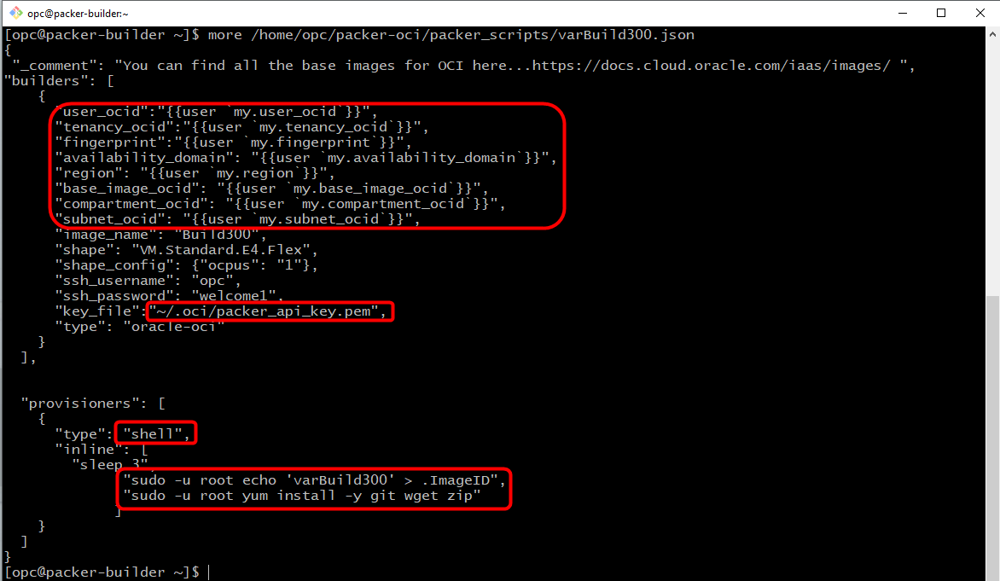

# Packer Workshop - Using Packer: Basic Concepts
## Before You Begin
### Introduction

In this lab you install several packages, label your image, upload a configuration file and move it.  

**NOTE:** `If you are pressed for time, feel free to look at the varBuild300.json, if you understand the logic, you can jump to Lab 400 as the builds are cummulative and all the Lab300 "pieces" are in 400`
### Objectives

- Create an packer image with software installed
- Learn to upload a configuration files from a local machine packer target image
- Log into an Instance of the Custom Image
### Required Artifacts

- Oracle Cloud Account - (configured in Lab 1)
- Your Compute Client Image (from Lab 2) or packer & git installed locally on your laptop.
- Your git repository with **DevDesktop.json** file committed and cloned to your Compute Client Image
- Your API Key pair (pem files) with Public Key added to Cloud user

##  **STEP 1**: Verify the **DevDesktop.json** file 

-  At this point, the **DevDesktop.json** file should be completely filled out and should look similar to this one.

  

##  **STEP 2**: Create and Populate the API PEM Key File

- Create packer\_api\_key.pem from User API Key created earlier

```
<copy>vi /home/opc/.oci/packer_api_key.pem</copy>
```

- Paste the contents of the Private PEM Key created in Lab 1, Step 4

##  **STEP 3**: Inspect the Packer Build File template varBuild300.json

```
<copy>more /home/opc/packer-oci/packer_scripts/varBuild300.json</copy>
```
-  Here you see the packer build file references the variables in the **DevDesktop.json** file containing all the OCIDs.  It also rferences the API PEM Key created in Lab 1.  Finally, it executes a shell script which performs a couple yum installs and creates a simply text file called **.ImageID**

  

## **STEP 4**: Packer Validate and Build

- Run packer validate to make sure your file is valid.  In the terminal window, run the following commands

  ```
  <copy>cd /home/opc/packer-oci/packer_scripts/</copy>
  ```
  ```
  <copy>packer validate -var-file=DevDesktop.json varBuild300.json</copy>
  ```
  ```
  <copy>packer build -var-file=DevDesktop.json varBuild300.json</copy>
  ```

  
  
  

  - Go back to the console and custom image process should be initiated.

  - **Navigate** to back to your browser's _OCI Console --> Instances_ tab. You should see an instance being provisioned, then your custom image being created, then the instance will be terminated. This will take a couple minutes.
  
  

  

- **Wait** till your script completes, before proceeding to the next step. You should see the following when the script completes.

  
## **STEP 5**: Launch an Instance of your Custom Image

- **Navigate** to _OCI Console --> Custom Images_ . **Select** the ellipse to the right of the image creation time,  select **Create Instance**

  
  

- Select a name for the image.

  

- Check the Image and Shape
  
  

- Double check the compartment, VCN, subnet compartment and subnet  

  

- Paste or choose your public key file, perhaps choosing it if you pasted it last time.
  
  

- **Click** Create

  

You will see in the "Provisioning", state for a couple of mins as we create the boot volume and instantiate the image.  

- Note the public IP address of your instance, you will connect to this in the next step.

  
## **STEP 6**: Connect to Custom Instance

- Using the IP address, ssh to your image in a terminal window (Mac/Linux) or with Putty(Windows)

  ```
  <copy>ssh -i packerkey opc@<yourPublicIPAdress></copy>
  ```

- ***Accept*** the addition of your machine to the instance's "known_hosts" by typing "yes"

- Start by checking the ImageID we created to track versions.  We should see varBuild300 and also check the Git version.

  ```
  <copy>cat .ImageID</copy>
  ```
  ```
  <copy>git --version</copy>
  ```

  

**You are ready to proceed to Lab 4**