# Packer Workshop - Using Packer:  Full Docker Developer Image Build
## Before You Begin
### Introduction

In this lab you build on the concepts of the previous labs, but will add commentary and discussion around more advanced topics.  

### Objectives

- Create an image with a desktop (gnome) and software installed (git, docker)
- Learn considerations for ordering of services and dependencies

### Required Artifacts

- Oracle Cloud Account - (configured in Lab 1)
- Your Client Image (from Lab 2) or packer & git installed locally on your laptop.
- Your git repository with **DevDesktop.json** and API PEM key file committed.

## **STEP 1**: Inspect the Packer build template: varBuild400.json

- If not already connected, ssh into your packer-builder virtual machine and navigate to the following directory.

  ```
  <copy>cd /home/opc/packer-oci/workshops/packer-oci/packer_scripts</copy>
  ```

- In the file varBuild400.json, you will see the components of an example real-world installation. In the terminal window, examine varBuild400.json by typing:

  ```
  <copy>more varBuild400.json</copy>
  ```

- You will notice there are more commands here:

  - Setting of Firewall rule for port 5901
  - Copy Script to change the password for set for VNCServer to host

  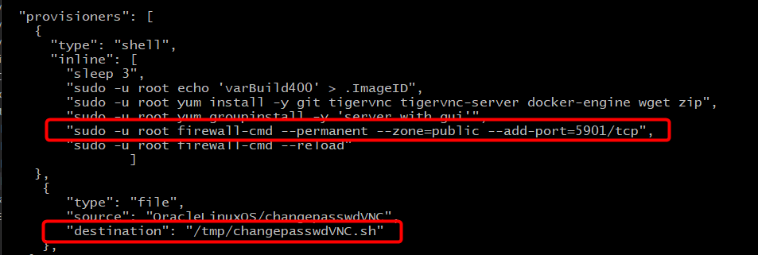

- Later in the same build script, you see the use of the files moved above:

  - Enabling the Service VNCServer on port 5901
  - Enable execute permission on Script to change the password for VNCServer

  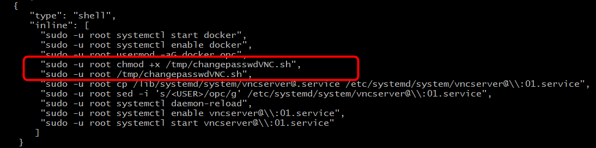

**NOTE:** Be sure set the VNC Password in the file **/home/opc/packer-oci/packer_scripts/OracleLinuxOS/changepasswordVNC**.

## **STEP 2**: Validate the Packer build template and Run Packer Build

- Run packer validate to make sure your file is valid, again using your _DevDesktop.json_ file

  ```
  <copy>packer validate -var-file=DevDesktop.json  varBuild400.json</copy>
  ```
  ```
  <copy>packer build -var-file=DevDesktop.json  varBuild400.json</copy>
  ```

  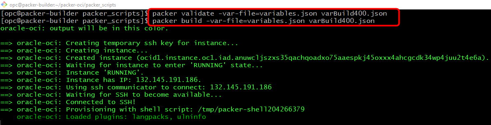

  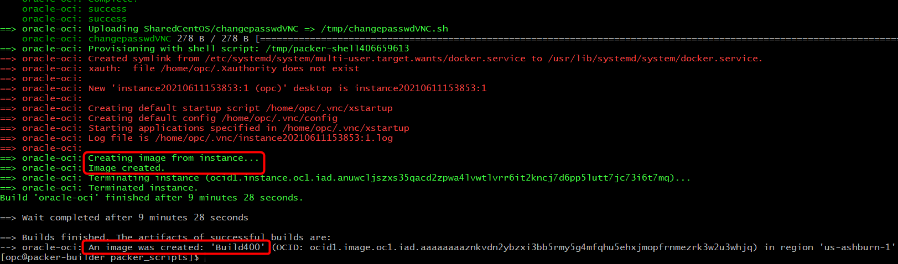 

  - **Navigate** to back to your browser's _OCI Console --> Instances_ tab. You should see your custom image being created, then terminated. This will take a couple minutes.

  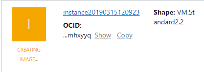
## **STEP 3**: Launch an Instance of your Custom Image

- **Navigate** to _OCI Console --> Custom Images_ to see your new image. Using the ellipse to the right of the image creation time, **select** "Create Instance"

  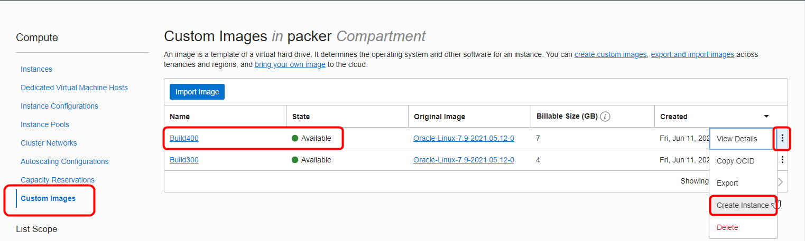 


- **Select** a name for the image (Lab400).

  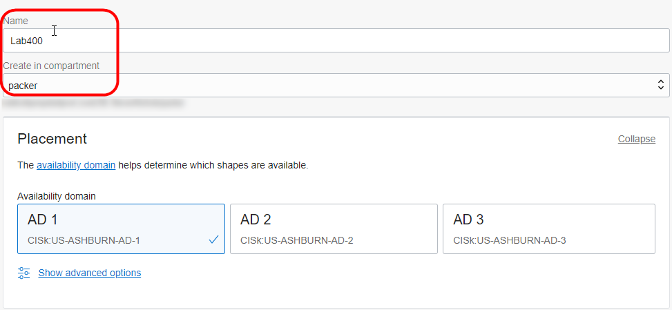 

- Check the Image and Shape
  
  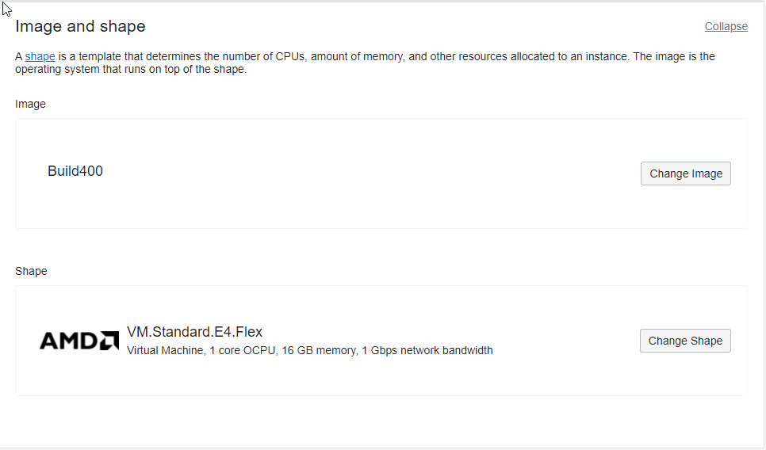 

- Double check the compartment, VCN and subnet
    
  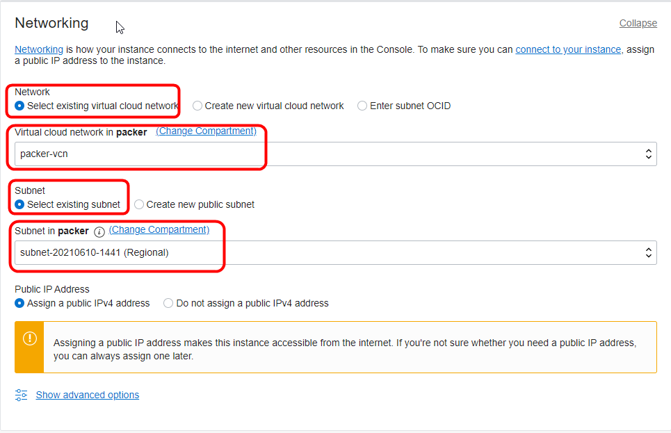 

- **Paste** or choose your public key file.
    
  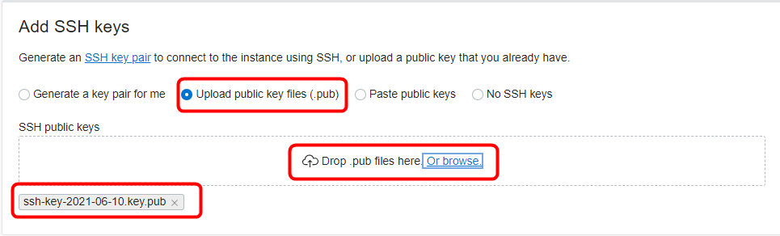 

- Select **Create** You will see in the "Provisioning", state for a couple of mins as you create the boot volume and instantiate the image.  

  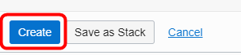 
  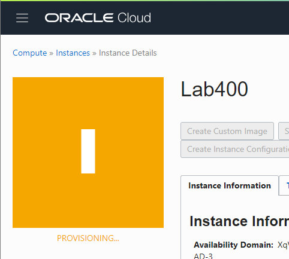
  
- Once provisioning completes note the public IP address of your instance, you will connect to this in the next step.

  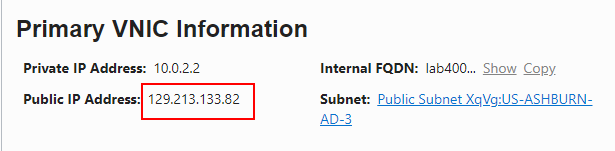

## **STEP 4**: Connect to Custom Instance

Using the IP address collected in the prior step, you could connect via ssh with your private key as you did in Lab 300. Since you installed VNCServer in your packer script, we will connect using VNC to the server running on port **5901**.  

_Please note: While you can use the finder built-in (Mac), you are better using a VNC Client which allows cut-and-paste (the built-in doesn't) like Real VNC Viewer.  Real VNC Viewer is also a good choice for Windows users._

- **Open VNC Viewer** and enter the Lab400 Instance **IP Address** along with port **:5901**.   Click **Continue** for the encryption warning.

  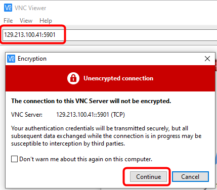

- You will see the VNC Login Window, enter the VNC password you configured in Step 1 above:

  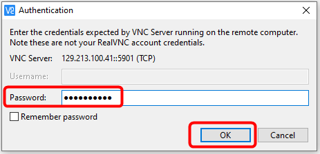 
  
- **Click** next to complete the welcome dialog
  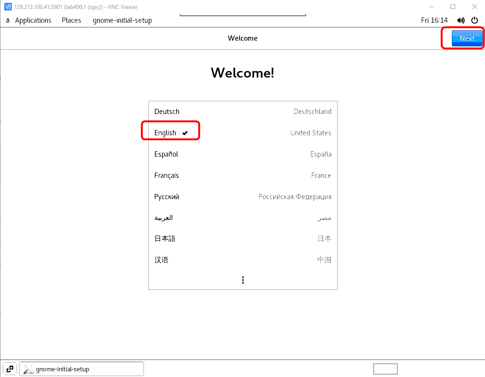
  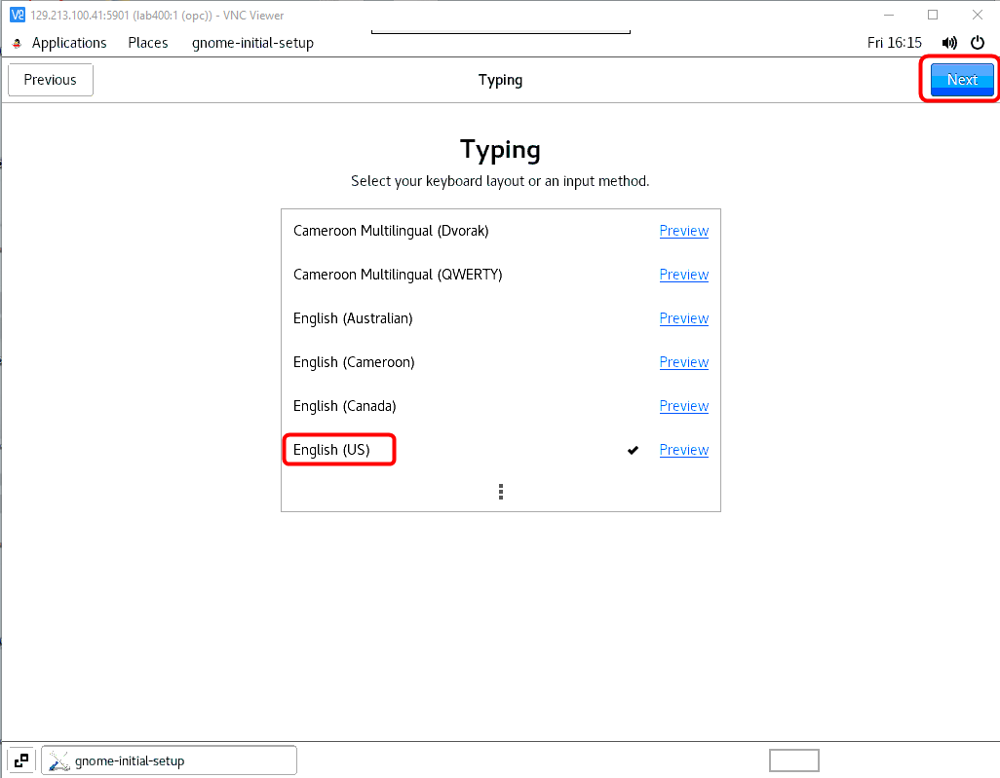
  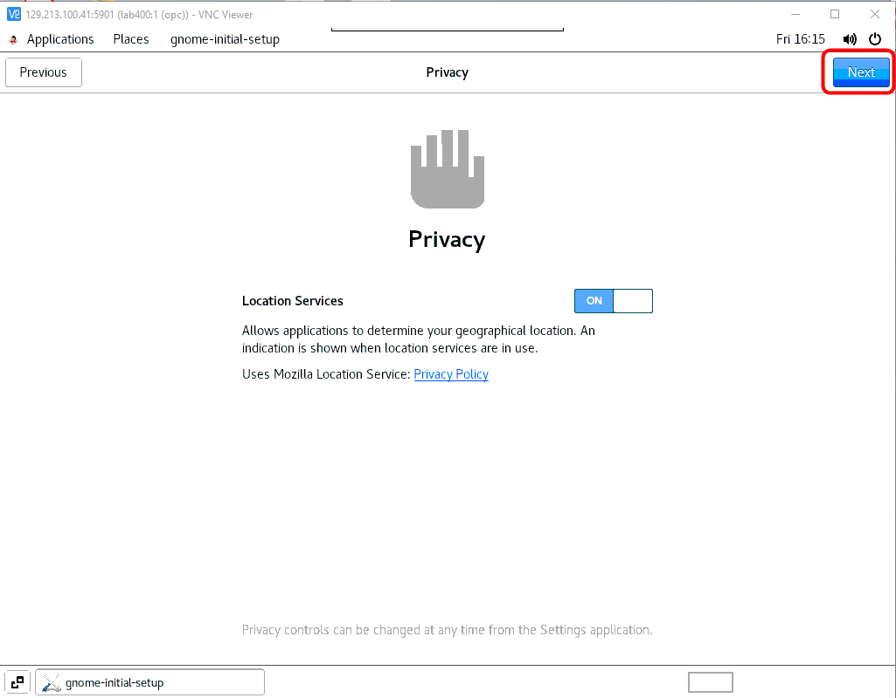 
  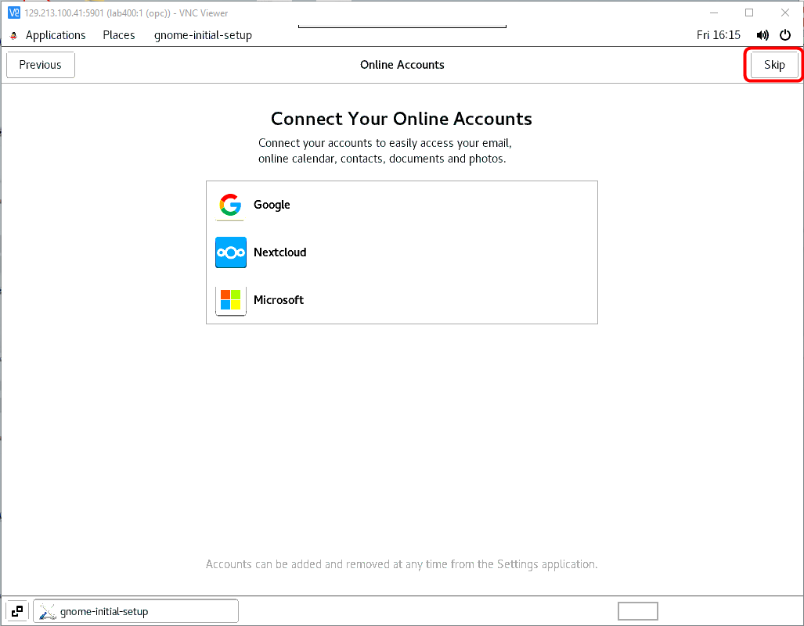  
  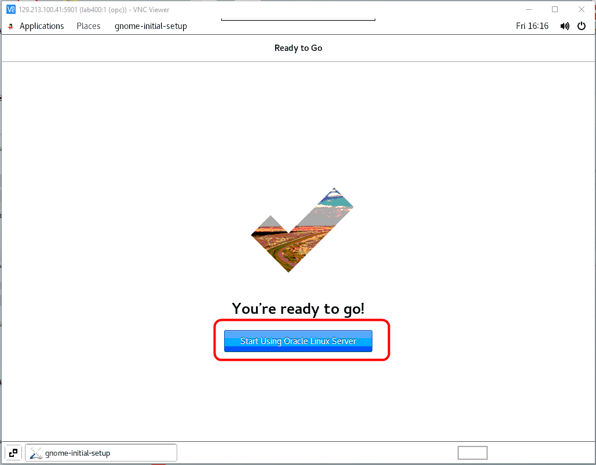 
  
- **Launch** a terminal window by right clicking on the Desktop.

  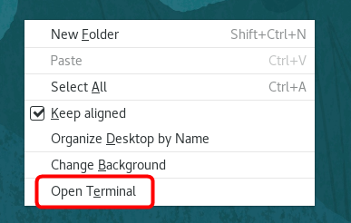 

-  You will start by checking the ImageID you created to track versions. Enter the command below you should see "varBuild400":

  ```
  <copy>more .ImageID</copy>
  ```

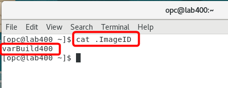 

_You can see that VNCServer is starting normally, so our enabled service is working in the completed image._

**Congratulations, you are done with the Workshop**